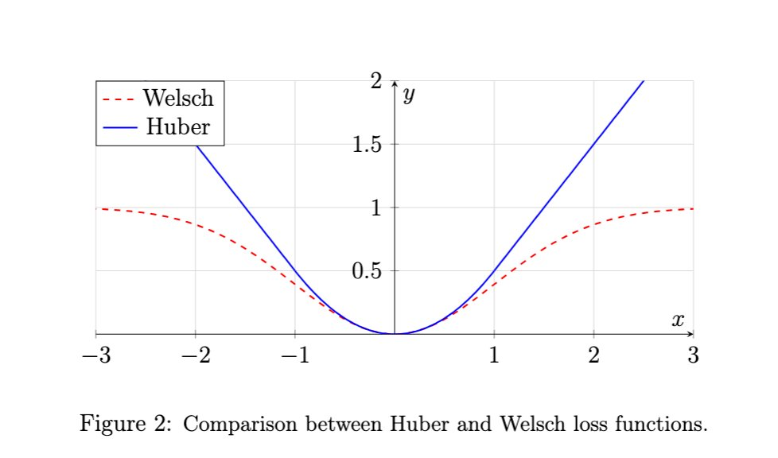
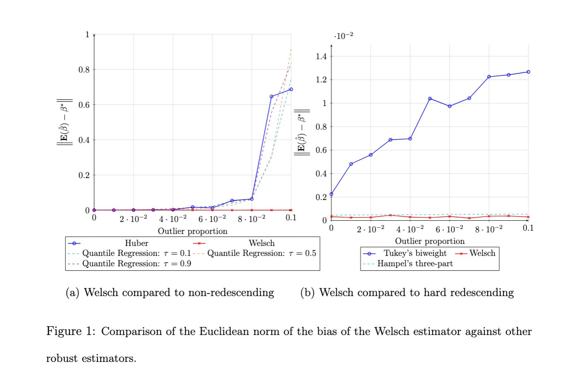

# Robust Regression under Adversarial Contamination: Theory and Algorithms for the Welsch Estimator

[](https://arxiv.org/abs/2412.19183)
[](https://github.com/ilyeshammouda/Robust-Regression-under-Adversarial-Contamination-Theory-and-Algorithms-for-the-Welsch-Estimator)
[](https://opensource.org/licenses/MIT)
[](https://www.python.org/)

Implementation of the paper **"Robust Regression under Adversarial Contamination: Theory and Algorithms for the Welsch Estimator"**.

[Ilyes Hammouda](https://github.com/ilyeshammouda), [Mohamed Ndaoud](https://sites.google.com/view/mndaoud), [Abd-Krim Seghouane](https://findanexpert.unimelb.edu.au/profile/470194-karim-seghouane)


## Overview

Convex and penalized robust regression methods often suffer from a persistent bias induced by large outliers, limiting their effectiveness in adversarial or heavy-tailed settings. In this work, we study a smooth redescending non-convex M-estimator, specifically the Welsch estimator, and show that it can eliminate this bias whenever it is statistically identifiable. We focus on high-dimensional linear regression under adversarial contamination, where a fraction of samples may be corrupted by an adversary with full knowledge of the data and underlying model.


A central technical contribution of this paper is a practical algorithm that provably finds a statistically valid solution to this non-convex problem. We show that the Welsch objective remains locally convex within a well-characterized basin of attraction, and our algorithm is guaranteed to converge into this region and recover the desired estimator.

### Key contributions

- We prove the Welsch objective remains **locally convex** within a well-characterized basin of attraction.
- We propose a practical **two-stage algorithm** (L1 warm start → Welsch refinement) that provably converges into this region and recovers the desired estimator.
- We introduce a **scaled (adaptive) variant** of the temperature parameter $\tau$ that removes the dependency on the unknown noise level $\sigma$.
- We establish improved unbiasedness in the presence of large outliers.
- Extensive experiments on synthetic and real-world data demonstrate the superiority of the Welsch estimator over Huber, Tukey's biweight, Hampel's three-part, and quantile regression.

<p align="center">
  
</p>
<p align="center"><em>Figure 1: Comparison between Huber and Welsch loss functions.</em></p>

<p align="center">
  
</p>
<p align="center"><em>Figure 2: Comparison of the Euclidean norm of the bias of the Welsch estimator against other robust estimators.</em></p>


## Why the Welsch estimator?

| Property | Huber / LAD | Tukey / Hampel | **Welsch (Ours)** |
|:---|:---:|:---:|:---:|
| Redescending influence function | ✗ | ✓ | ✓ |
| Smooth (infinitely differentiable) | ✗ | ✗ | ✓ |
| Provable convergence guarantee | ✓ | ✗ | ✓ |
| Bias elimination under adversarial contamination | ✗ | — | ✓ |

The Welsch loss is defined as:

$$\ell_\tau(u) = \frac{1}{\tau}\left(1 - \exp\left(-\frac{\tau}{2}u^2\right)\right)$$

where $\tau$ > 0 is the temperature parameter controlling the trade-off between robustness and efficiency.


## Repository structure

```
.
├── algorithms/                          # Core estimator implementations
│   ├── Welsch_adapative_sigma.py        # Welsch estimator with adaptive (scaled) $\tau$
│   ├── Welch_non_adaptative.py          # Welsch estimator with fixed $\tau$
│   ├── Huber.py                         # Huber M-estimator baseline
│   ├── OLS.py                           # Ordinary Least Squares baseline
│   ├── help_functions.py                # Data generation, Welsch tools, CV utilities
│   └── leave_one_out.py                 # K-Fold CV evaluation for all estimators
├── assets/
│   └── images/                          # Figures from the paper
├── Experiments/
│   └── exps.ipynb                       # All experiments (breakdown, MSE, real-world, sensitivity)
├── Data/
│   └── Ames_Housing_Data.csv            # Ames Housing dataset for real-world experiments
├── Results/                             # Pre-computed results (long-running experiments)
│   ├── break_down_points/               # Breakdown point experiment results
│   ├── MSE/                             # MSE distribution results
│   └── Sensitivity_to_the_noise_level/  # Noise sensitivity results
├── requirements.txt
├── LICENSE
└── README.md
```


## Installation

The package requires Python ≥ 3.10. We recommend creating a dedicated environment:

```bash
conda create -n welsch python=3.11
conda activate welsch
```

Clone the repository and install the dependencies:

```bash
git clone https://github.com/ilyeshammouda/Robust-Regression-under-Adversarial-Contamination-Theory-and-Algorithms-for-the-Welsch-Estimator.git
cd Robust-Regression-under-Adversarial-Contamination-Theory-and-Algorithms-for-the-Welsch-Estimator
pip install -r requirements.txt
```


## Quickstart

### Using the Welsch estimator on your data

```python
import numpy as np
from algorithms.Welsch_adapative_sigma import WelschAlgo

# Your data
X = np.random.randn(1000, 10)
beta_true = np.random.randn(10)
y = X @ beta_true + np.random.randn(1000)

# Fit the Welsch estimator (adaptive $\tau$)
model = WelschAlgo(X, y)
beta_hat = model.optimizer_approach(tau=1.0, maxiter=100)

print("Estimation error:", np.linalg.norm(beta_hat - beta_true))
```

### Selecting $\tau$ via cross-validation

```python
import numpy as np
from algorithms.Welsch_adapative_sigma import WelschAlgo

tau_candidates = np.linspace(0.01, 10, 50)
model = WelschAlgo(X, y)
best_tau = model.grid_search_cv(tau_candidates, approach_method='optimizer', n_splits=5)
beta_hat = model.optimizer_approach(tau=best_tau, maxiter=100)
```


## Reproducing the experiments

All experiments from the paper are contained in a single notebook:

```bash
cd Experiments
jupyter notebook exps.ipynb
```

The notebook is organized into four main sections:

### 1. Breakdown point experiments

Compares the bias of the Welsch estimator against Huber, Tukey's biweight, Hampel's three-part, and quantile regression (q = 0.1, 0.5, 0.9) as the contamination fraction $\epsilon$ varies from 0 to 0.10. Uses Pareto-distributed noise with n = 10,000 samples, p = 10 features, and 5,000 repetitions per contamination level.

> **Note:** These experiments are computationally expensive. Pre-computed results are provided in `Results/break_down_points/`.

### 2. MSE distribution experiments

Visualizes the distribution of the mean squared error across 1,000 independent runs for each estimator under heavy adversarial contamination. Two comparisons are provided: Welsch vs. Huber, and Welsch vs. other redescending estimators (Tukey, Hampel).

> Pre-computed results are available in `Results/MSE/`.

### 3. Real-world data experiments

Evaluates all estimators on two regression datasets using K-Fold cross-validation with robust metrics (Median Absolute Error, Mean Absolute Error, IQR of residuals):
- **Ames Housing** (included in `Data/`): 2,930 observations, predicting sale price.
- **Abalone** (fetched from UCI repository): 4,177 observations, predicting ring count.

### 4. Sensitivity to the noise level

Studies how the normalized MSE $\frac{\mathbf{E}\left\| \hat{\beta} - \beta^*\right\|^2}{\sigma^2}$ evolves as the noise variance $\sigma^2$ increases from 1 to 100. Compares the fixed-$\tau$ Welsch estimator against the adaptive (scaled) variant, demonstrating that the scaled version maintains stable performance regardless of the noise level.

> Pre-computed results are available in `Results/Sensitivity_to_the_noise_level/`.


## Algorithm details

The two-stage optimization procedure works as follows:

**Stage 1 — L1 warm start.** Solve the Least Absolute Deviation (LAD) regression problem to obtain an initial estimate $\beta_{0}$ that lies within the basin of attraction of the Welsch objective. This stage is robust to outliers and provides a good starting point.

**Stage 2 — Welsch refinement.** Starting from $\beta_{0}$, minimize the Welsch loss. For the adaptive variant, the temperature parameter is rescaled as $\frac{\tau}{\hat{\sigma}}$, where $\hat{\sigma}$ is the median absolute residual from Stage 1.

Three optimization backends are available:
- `optimizer_approach`: Two-stage L1 warm start + scipy BFGS (recommended).
- `gradient_descent_approach`: Two-stage L1 warm start + Nesterov-style gradient descent.
- `fixed_point_approach`: Iterative fixed-point method.


## Citation

If you find this work useful, please cite:

```bibtex
@misc{hammouda2024robust,
      title={Robust Regression under Adversarial Contamination: Theory and Algorithms for the Welsch Estimator},
      author={Ilyes Hammouda and Mohamed Ndaoud and Abd-Krim Seghouane},
      year={2024},
      eprint={2412.19183},
      archivePrefix={arXiv},
      primaryClass={math.ST},
      url={https://arxiv.org/abs/2412.19183},
}
```


## License

This project is licensed under the MIT License. See [LICENSE](LICENSE) for details.
